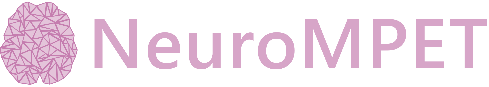

<div align="center">
  
  <br><br>
  <p align="center"><strong>Neuro Multiple-Network Poroelastic Theory: Meshing & Modelling</strong></p>
</div>

<div align="center" style="display: flex; justify-content: center; gap: 10px; flex-wrap: wrap; margin-top: 10px;">
  <a href="https://profiles.ucl.ac.uk/101480-ellis-langford"></a>
  <a href="https://orcid.org/0009-0006-1269-2632"></a>
  <a href="https://github.com/ellis-langford"></a>
  <a href="https://uk.linkedin.com/in/ellis-langford-8333441ab"></a>
</div>

## Introduction

NeuroMPET is a processing workflow that: preprocesses, registers, segments a NIfTI image; then generates meshes, maps tissue classes onto the mesh and models using the MPET solver.

The core solver code was developed by Liwei Guo (liwei.guo@ucl.ac.uk) and Yiannis Ventikos (y.ventikos@ucl.ac.uk) at University College London. The core solver code is not published in this GitHub repository, to request access to the MPET solver core code please contact Ellis Langford (ellis.langford.19@ucl.ac.uk).


## Requirements

To successfully run the NeuroMPET pipeline, please ensure the following requirements are met:

**Ubuntu 22.04 + Docker 27.3.1 + Python 3.10**<br>
*(other versions may be compatible but have not been tested)*


## Installation & Quick Start

To install the necessary components for NeuroMPET, please follow the steps below:

► Either, pull the docker image from GitHub container registry:

  ```bash
  docker pull ghcr.io/ellis-langford/neuro_mpet:v1
  ```

► Or clone the code from the GitHub repo and build image yourself:
  
  ```bash
  git clone https://github.com/ellis-langford/NeuroMPET.git
  cd NeuroMPET
  docker build -t ghcr.io/ellis-langford/neuro_mpet:v1 .
  ```
  
► Lauch a docker container from the NeuroMPET docker image:
  
  ```bash
  docker run -it -v /path/to/data:/path/to/data ghcr.io/ellis-langford/neuro_mpet:v1 bash
  ```

► Edit the example properties file to suit your requirements
  
  ```bash
  nano example_properties_file.json
  ```

► Navigate to your chosen output directory:
  
  ```bash
  cd /output_dir
  ```

► Run the pipeline:
  
  ```bash
  python3.10 /app/src/main.py --input_im /path/to/input/dir --props_fpath /path/to/properties/file
  ```

## Pipeline Modules & Options
`Preprocessing`<br>
► image_prep.py<br>
► Executed with the *--run_preprocessing* flag<br>
► Inputs:<br>
   > *--input_im*: an NIfTI image<br>

► Optional Parameters:
   > *--modality*: modality of image to be analysed (default: t1)<br>
   > *--reset_origin*: reset image origin (default: True)<br>
   > *--normalise_intensities*: normalise image intensities (default: true)<br>
   > *--wm_peak_scaling*: scale intensities using WM peak, else linear scaling (default: false)<br>
   > *--rescale_max*: maximum value to use in rescaling (default: 1000)<br>
   > *--n4_bias_correct*: perform N4 bias correction (default: true)<br>

***
`Registration`<br>
► registration.py<br>
► Executed with the *--run_registration* flag<br>
► Inputs:<br>
   > *--input_im*: an NIfTI image,<br>
   > *--input_atlas* (optional): atlas to register input image to (default: MNI atlas)<br>

► Other Parameters:<br>
   > *--reg_type*: type of registration, must match ANTs registration options (default: Affine)<br>

***
`Cortical Segmentation`<br>
► cortical_segmentation.py<br>
► Executed with the *--run_cortical_segmentation* flag<br>
► Inputs:<br>
   > *--input_im*: an NIfTI image, or<br>
   > *--freesurfer_outputs*: a folder of FreeSurfer outputs<br>

► Other Parameters:<br>
   > *--segmentation_mode*: method of segmentation, FreeSurfer/SynthSeg (default: SynthSeg)<br>
   > *--subject_id*: subjectID of data, used in logging only<br>
   > *--regions*: list of regions to process, defaults to 7 cortical regions<br>
   > *--use_gpu*: run SynthSeg mode using GPU (default: False)<br>
   > *--big_vents*: add flag to FreeSurfer command to aid in processing of subjects with large ventricles (default: false)<br>
   > *--large_FOV*: add flag to FreeSurfer command to aid in processing of subjects with large FOV (default: false)<br>

***
`Ventricular Segmentation`<br>
► Manual with ITK-SNAP<br>
► Currently, the output segmentations for the ventricles from FreeSurfer are disjointed and require manual fixing<br>
► Future work will implement improved ventricular segmentation to remove this step<br>

***
`Surface Generation`<br>
► surface_generation.py<br>
► Executed with the *--run_surface_generation* flag<br>
► Inputs:<br>
   > *--segmentation_dir*: a folder of NIfTI binary segmentation files, or<br>
   > --segmentations*: a comma seperated list of NIfTI binary segmentation files<br>

► Other Parameters:<br>
   > *--regions*: list of regions to process, defaults to 7 cortical regions<br>
   > *--generate_global*: generate a global surface by subtracting the ventricles from wholebrain (default: true)<br>
   > *--fs_surfaces*: generate .stl files using FreeSurfer tools, else use pyvista (default: false)<br>

***
`Mesh Generation`<br>
► mesh_generation.py<br>
► Currently the script cannot be executed in Simpleware via the command line<br>
► Future work will implement automated processing of the script to remove the need to run in the Simpleware GUI.<br>
► Inputs:<br>
   > *--surface_dir*: a folder of .stl surface files<br>

► Other Parameters:<br>
   > *--starting_coarseness*: dictionary of mesh coarseness values to start iterations from (default: -50 for all)<br>
   > *--coarseness_steps*: number of coarsness values to try when generating mesh (default: 15)<br>
   > *--target_global_elements*: target element count for global mesh (default: 2_500_000)<br>
   > *--tolerance_frac*: tolerance fraction for actual elements vs target elements (default: 0.2)<br>

***
`Mesh Mapping`<br>
► mesh_map.py<br>
► Executed with the *--run_mesh_mapping* flag<br>
► Inputs:<br>
   > *--mesh_dir*: a folder of .vtk format mesh files,<br>
   > *--surface_dir* (optional): a folder containing a wholebrain.stl file to be used for outer surface fixing,<br>
   > *--dwi_dir* (optional): a folder containing DWI input images,<br>
   > *--cbf_dir* (optional): a folder containing CBF input images<br>

► Other Parameters:<br>
   > *--adjust_labels_dwi*: adjust mesh labels based on DWI inputs supplied with --dwi_dir (default: false)<br>
   > *--adjust_outer_labels*: adjust outer labels of the mesh based on a wholebrain.stl file supplied with --surface_dir (default: false)<br>
   > *--generate_cbf_map*: generate an CBF scalar map from a CBF NIfti image supplied with --cbf_dir (default: false)<br>
   > *--generate_fa_map*: generate an FA scalar map from a FA NIfti image supplied with --dwi_dir (default: false)<br>

***
`MPET Solver`<br>
► solver.py<br>
► Executed with the *--run_modelling* flag<br>
► Inputs:<br>
   > *--mesh_dir*: a folder of .vtk format mesh files, and<br>
   > *--surface_dir*: a folder containing a wholebrain.stl and ventricles.stl file to be used in creation of .bit file,<br>
   > *--labels_fpath*: path to an ROI labels .txt file,<br>
   > *--bc_fpath* (optional): path to a boundary condition .csv file (default: general healthy control BC file)<br>

► Other Parameters:<br>
   > *--timestep_size*: size of timestep (default: 0.1)<br>
   > *--timestep_count*: number of time steps per boundary condition waveform (default: 10)<br>
   > *--timestep_interval*: interval between two VTU output files (default: 100)<br>


## Output Structure

The output directory structure is as follows:

```
Output directory
├── inputs
│   ├── image.nii.gz
│   └── atlas.nii.gz
├── interim_outputs
│   ├── preprocessing
│   │   ├── origin_reset
│   │   ├── intensity_normed
│   │   └── N4_corrected
│   ├── registration
│   ├── segmentation
│   │   ├── {region} outputs
│   │   └── fs_outputs
│   ├── surface_generation
│   │   └── surfaces
│   ├── mesh_generation
│   │   └── meshes
│   └── mesh_mapping
│       ├── global_mesh_info
│       ├── regional_mesh_info
│       ├── surface_info
│       ├── regional_labels
│       └── regional_labels.txt
├── outputs
│   ├── preprocessed_im.nii.gz
│   ├── registered_im.nii.gz
│   ├── segmentations
│   ├── surfaces
│   ├── meshes
│   ├── labels.txt
│   ├── CBF_map.txt
│   ├── FA_map.txt
│   └── modelling_outputs
├── logs
├── results.txt
└── errors.txt
```
<br>
► `inputs:` contains a copy of the input images<br>
► `interim_outputs`: contains copies of files with various stages of processing applied<br>
► `logs:` contains a plugin log (log.txt) and a record of the inputs and parameters (options.txt)<br>
► `outputs:` contains the final output files<br>
► `results.txt:` only produced if the pipeline executes successfully<br>
► `errors.txt:` only produced if the pipeline fails to execute successfully (contains error info)<br>


## Citation
The following papers should be cited when this code is used:
```
1. Tully, B. and Ventikos, Y. (2011).<br>
   Cerebral water transport using multiple-network poroelastic theory: application to normal pressure hydrocephalus.<br>
   Journal of Fluid Mechanics, 667:188-215.<br>
2. Guo, L., Vardakis, J. C., Lassila, T., Mitolo, M., Ravikumar, N., Chou, D., … Ventikos, Y. (2018).<br>
   Subject-specific multi-poroelastic model for exploring the risk factors associated with the early stages of Alzheimer’s disease.<br>
   Interface Focus, 8:20170019.<br>
3. Guo, L., Vardakis, J. C., Chou, D., and Ventikos, Y. (2020).<br>
   A multiple-network poroelastic model for biological systems and application to subject-specific modelling of cerebral fluid transport.<br>
   International Journal of Engineering Science, 147:103204.<br>
```