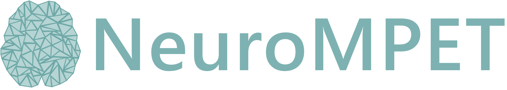

<div align="center">
  
  <br><br>
  <p align="center"><strong>Neuro Multiple-Network Poroelastic Theory: Image-to-Model Pipeline</strong></p>
</div>

<div align="center" style="display: flex; justify-content: center; gap: 10px; flex-wrap: wrap; margin-top: 10px;">
  <a href="https://profiles.ucl.ac.uk/101480-ellis-langford"></a>
  <a href="https://orcid.org/0009-0006-1269-2632"></a>
  <a href="https://github.com/ellis-langford"></a>
  <a href="https://uk.linkedin.com/in/ellis-langford-8333441ab"></a>
</div>

## Introduction

NeuroMPET is an image-to-model pipeline for subject-specific modelling of cerebral fluid dynamics in the brain.

The pipeline consists of the following stages:
- Preprocessing
- Registration
- Cortical Segmentation
- Ventricular Segmentation
- Surface Generation
- Mesh Generation
- Mesh Mapping
- Modelling
- Results Processing

The core solver code was developed by Liwei Guo (liwei.guo@ucl.ac.uk) and Yiannis Ventikos (y.ventikos@ucl.ac.uk) at University College London. The core solver code is not published in this GitHub repository. To request access to the MPET solver core code, please contact Ellis Langford (ellis.langford.19@ucl.ac.uk).


## Requirements

To run the NeuroMPET pipeline successfully, please ensure the following requirements are met:

**Ubuntu 22.04 + Docker 27.3.1 + Python 3.10**<br>
*(other versions may be compatible but have not been tested)*


## Installation & Quick Start

To install the necessary components for NeuroMPET, please follow the steps below:

► Either, pull the docker image from GitHub container registry:

  ```bash
  docker pull ghcr.io/ellis-langford/neuro_mpet:v2
  ```

► Or clone the code from the GitHub repo and build image yourself:
  
  ```bash
  git clone https://github.com/ellis-langford/NeuroMPET.git
  cd NeuroMPET
  docker build -t ghcr.io/ellis-langford/neuro_mpet:v2 .
  ```
  
► Launch a docker container from the NeuroMPET docker image:
  
  ```bash
  docker run -it -v /path/to/data:/path/to/data ghcr.io/ellis-langford/neuro_mpet:v2 bash
  ```

► Edit the example properties file to suit your requirements:
  
  ```bash
  nano example_properties_file.json
  ```

► Navigate to your chosen output directory:
  
  ```bash
  cd /output_dir
  ```

► Run the pipeline:
  
  ```bash
  python3.10 /app/src/main.py --input_im /path/to/input_image.nii.gz --props_fpath /path/to/properties_file.json
  ```

## Pipeline Modules & Options
`Preprocessing`<br>
► image_prep.py<br>
► Executed with the *--run_preprocessing* flag<br>
► Inputs:<br>
   > *--input_im*: path to input NIfTI image<br>

► Optional Parameters:
   > *--reset_origin*: reset image origin (default: True)<br>
   > *--normalise_intensities*: normalise image intensities (default: true)<br>
   > *--rescale_max*: maximum value to use in rescaling (default: 1000)<br>
   > *--n4_bias_correct*: perform N4 bias correction (default: true)<br>

***
`Registration`<br>
► registration.py<br>
► Executed with the *--run_registration* flag<br>
► Inputs:<br>
   > *--input_im*: path to input NIfTI image<br>
   > *--input_atlas* (optional): atlas to register input image to (default: MNI atlas)<br>

► Other Parameters:<br>
   > *--reg_type*: type of registration, must match ANTs registration options (default: Affine)<br>

***
`Cortical Segmentation`<br>
► cortical_seg.py<br>
► Executed with the *--run_cortical_segmentation* flag<br>
► Inputs:<br>
   > *--input_im*: path to input NIfTI image<br>

► Other Parameters:<br>
   > *--use_gpu*: run SynthSeg using GPU (default: False)<br>

***
`Ventricular Segmentation`<br>
► Manual refinement of SynthSeg mask with ITK-SNAP<br>
► Currently, the ventricle segmentations produced by SynthSeg are disjointed and require manual fixing<br>
► Future work will implement improved ventricular segmentation to remove this manual step<br>

***
`Surface Generation`<br>
► surface_generation.py<br>
► Executed with the *--run_surface_generation* flag<br>
► Inputs:<br>
   > *--segmentations*: a folder or comma-separated list of NIfTI binary segmentation files<br>

***
`Mesh Generation`<br>
► mesh_generation.py<br>
► Executed with the *--run_mesh_generation* flag<br>
► Inputs:<br>
   > *--surfaces*: a folder or comma-separated list of .stl surface files<br>

► Other Parameters:<br>
   > *--target_global_elements*: target tetrahedral element count for the global mesh (default: 2_500_000)<br>
   > *--tolerance*: tolerance fraction for actual elements vs target elements (default: 0.2)<br>
   > *--mesh_iterations*: maximum number of iterations to attempt during meshing (default: 50)<br>
   > *--generate_region_meshes*: generate regional meshes in addition to the global mesh (default: false)<br>

***
`Mesh Mapping`<br>
► mesh_map.py<br>
► Executed with the *--run_mesh_mapping* flag<br>
► Inputs:<br>
   > *--mesh*: path to a global .vtk mesh file<br>
   > *--surfaces*: a folder or comma-separated list of .stl surface files<br>

***
`MPET Solver`<br>
► solver.py<br>
► Executed with the *--run_modelling* flag<br>
► Inputs:<br>
   > *--mesh*: path to a global .vtk mesh file<br>
   > *--surfaces*: a folder or comma-separated list containing a wholebrain.stl and ventricles.stl file to be used in creation of .bit file<br>
   > *--solver_labels_file*: path to a solver ROI label .txt file<br>
   > *--bc_file* (optional): path to a boundary condition .csv file<br>

► Other Parameters:<br>
   > *--timestep_size*: size of timestep (default: 0.1)<br>
   > *--waveform_timesteps*: number of time steps per boundary condition waveform (default: 10)<br>
   > *--num_waveforms*: number of total boundary condition waveforms to use to ensure steady-state reached (default: 50)<br>
   > *--output_timestep_interval*: interval between two VTU output files (default: 100)<br>

***
`Results Processing`<br>
► results_processing.py<br>
► Executed with the *--run_results_processing* flag<br>
► Inputs:<br>
   > *--modelling_outputs*: a folder containing modelling .vtu output files<br>
   > *--input_im*: input image in the same space as the global mask<br>
   > *--global_mask*: path to a global binary mask<br>
   > *--labels_file*: path to a detailed ROI region-label .txt file used for region-wise results processing<br>

► Other Parameters:<br>
   > *--results_timestep*: solver timestep to use for results processing (default: 500)<br>
   > *--volume_weighted_results*: compute regional results using tetrahedral volume weighting (default: true)<br>
   > *--register_to_mni*: register the final image and result NIfTI files to the MNI atlas (default: false)<br>
   > *--results_max_dist_mm*: maximum voxel-to-mesh distance to use in generation of NIfTI maps (default: 3.0)<br>


## Output Structure

The output directory structure is as follows:

```
Output directory
├── inputs
├── interim_outputs
│   ├── preprocessing
│   ├── registration
│   ├── segmentation
│   ├── surface_generation
│   ├── mesh_generation
│   ├── mesh_mapping
│   └── modelling
├── outputs
│   ├── image.nii.gz
│   ├── segmentations
│   ├── surfaces
│   ├── meshes
│   ├── labels
│   ├── modelling
│   ├── results.csv
│   ├── summary.csv
│   └── results_plots
├── logs
├── results.txt
└── errors.txt
```
<br>
► `inputs:` contains a copy of the input images<br>
► `interim_outputs`: contains copies of files with various stages of processing applied<br>
► `logs:` contains a plugin log (log.txt) and a record of the inputs and parameters (options.txt)<br>
► `outputs:` contains the final output files, including meshes, labels, results tables and NIfTI result plots<br>
► `results.txt:` only produced if the pipeline executes successfully<br>
► `errors.txt:` only produced if the pipeline fails to execute successfully (contains error info)<br>


## Citation
The following papers should be cited when this code is used:
```
1. Tully, B. and Ventikos, Y. (2011).<br>
   Cerebral water transport using multiple-network poroelastic theory: application to normal pressure hydrocephalus.<br>
   Journal of Fluid Mechanics, 667:188-215.<br>
2. Guo, L., Vardakis, J. C., Lassila, T., Mitolo, M., Ravikumar, N., Chou, D., … Ventikos, Y. (2018).<br>
   Subject-specific multi-poroelastic model for exploring the risk factors associated with the early stages of Alzheimer’s disease.<br>
   Interface Focus, 8:20170019.<br>
3. Guo, L., Vardakis, J. C., Chou, D., and Ventikos, Y. (2020).<br>
   A multiple-network poroelastic model for biological systems and application to subject-specific modelling of cerebral fluid transport.<br>
   International Journal of Engineering Science, 147:103204.<br>
```
